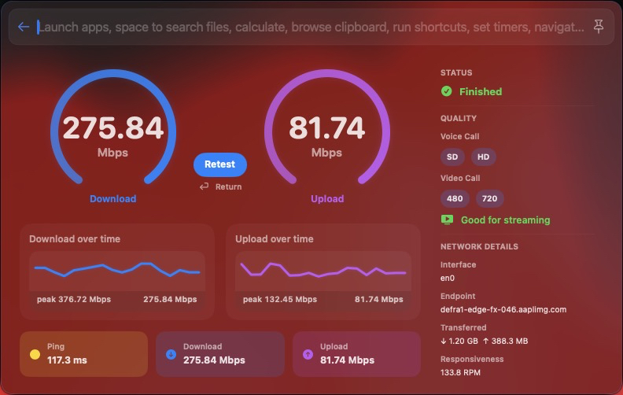

# Internet Speed Test — BetterTouchTool Launcher Plugin

A native Swift Launcher plugin for BetterTouchTool that runs macOS's built-in `networkQuality` test in a polished dashboard.

## Features

- Live download and upload speed meters
- Download and upload history graphs
- Peak throughput values
- Ping, latency, and responsiveness results
- Interface, endpoint, and transferred-data details
- **Retest** button
- Continues testing in the background if the Launcher is dismissed with Escape
- Restores the running or completed result when reopened
- Uses Apple's built-in `/usr/bin/networkQuality`; no third-party speed-test service or CLI is required

## Requirements

- macOS with `/usr/bin/networkQuality`
- A recent BetterTouchTool version with Swift Launcher plugin support
- Internet access

## Installation

1. Download `SpeedTestLauncherPlugin.swift`.
2. Copy it to:

   `~/Library/Application Support/BetterTouchTool/Plugins/`

3. Allow BetterTouchTool to compile/load the Swift plugin if prompted.
4. Open BTT Launcher and search for **Test Internet Speed**.

## Usage

Open **Test Internet Speed** from BTT Launcher. The test starts automatically. You can press Escape and the test will continue in the background. Reopen the Launcher item to view its current state or final results. Select **Retest** to run it again.

## How it works

The plugin runs Apple's `networkQuality -c`, parses its output, and displays the results in a native SwiftUI Launcher surface. During testing, local interface counters are sampled to animate the live meters.

## Files

- `SpeedTestLauncherPlugin.swift` — plugin source
- `plugin.json` — gallery metadata
- `screenshots/main.jpg` — preview image
- `LICENSE` — MIT License

## License

MIT
